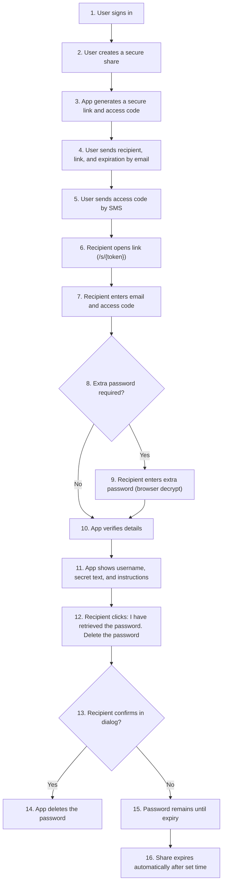
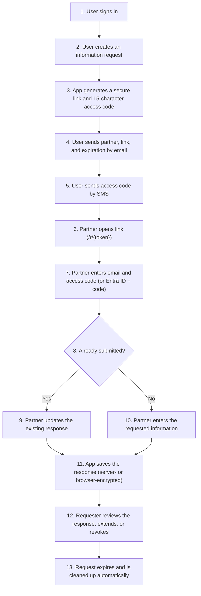
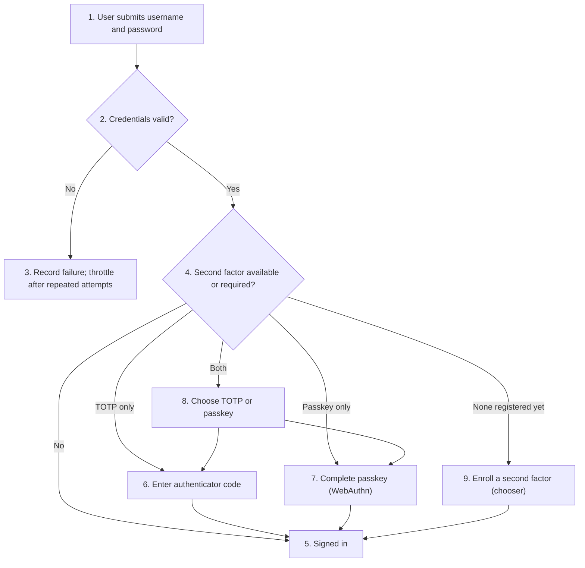

# User flow diagrams

## Secure share flow

```mermaid
flowchart TD
    S1["1. User signs in"] --> S2["2. User creates a secure share"]
    S2 --> S3["3. App generates a secure link and access code"]
    S3 --> S4["4. User sends recipient, link, and expiration by email"]
    S4 --> S4A["5. User sends access code by SMS"]
    S4A --> S5["6. Recipient opens link (/s/{token})"]
    S5 --> S6["7. Recipient enters email and access code"]
    S6 --> S6A{"8. Extra password required?"}
    S6A -->|Yes| S6B["9. Recipient enters extra password (browser decrypt)"]
    S6A -->|No| S7["10. App verifies details"]
    S6B --> S7
    S7 --> S8["11. App shows username, secret text, and instructions"]
    S8 --> S9["12. Recipient clicks: I have retrieved the password. Delete the password"]
    S9 --> S10{"13. Recipient confirms in dialog?"}
    S10 -->|Yes| S11["14. App deletes the password"]
    S10 -->|No| S12["15. Password remains until expiry"]
    S12 --> S13["16. Share expires automatically after set time"]
```

## Information request flow

```mermaid
flowchart TD
    R1["1. User signs in"] --> R2["2. User creates an information request"]
    R2 --> R3["3. App generates a secure link and 15-character access code"]
    R3 --> R4["4. User sends partner, link, and expiration by email"]
    R4 --> R4A["5. User sends access code by SMS"]
    R4A --> R5["6. Partner opens link (/r/{token})"]
    R5 --> R6["7. Partner enters email and access code (or Entra ID + code)"]
    R6 --> R7{"8. Already submitted?"}
    R7 -->|Yes| R8["9. Partner updates the existing response"]
    R7 -->|No| R9["10. Partner enters the requested information"]
    R8 --> R10["11. App saves the response (server- or browser-encrypted)"]
    R9 --> R10
    R10 --> R11["12. Requester reviews the response, extends, or revokes"]
    R11 --> R12["13. Request expires and is cleaned up automatically"]
```

## Local sign-in with second factor

```mermaid
flowchart TD
    L1["1. User submits username and password"] --> L2{"2. Credentials valid?"}
    L2 -->|No| L3["3. Record failure; throttle after repeated attempts"]
    L2 -->|Yes| L4{"4. Second factor available or required?"}
    L4 -->|No| L9["5. Signed in"]
    L4 -->|TOTP only| L5["6. Enter authenticator code"]
    L4 -->|Passkey only| L6["7. Complete passkey (WebAuthn)"]
    L4 -->|Both| L7["8. Choose TOTP or passkey"]
    L4 -->|None registered yet| L8["9. Enroll a second factor (chooser)"]
    L5 --> L9
    L6 --> L9
    L7 --> L5
    L7 --> L6
    L8 --> L9
```
</content>
